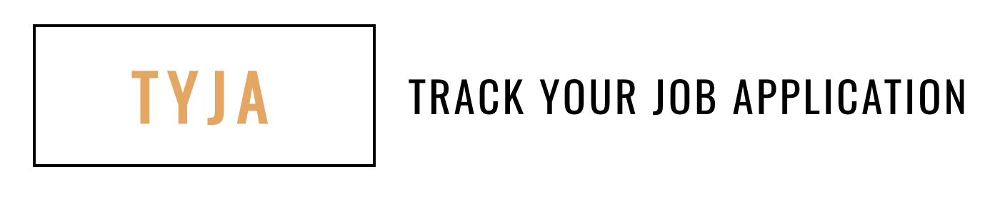

# Track Your Job Application 

## Purpose

Have you ever struggled while on the hunt for a job? It's discouraging enough to
miss out on opportunities you've worked hard for. It's even worse to realize
that you cost yourself an chance because you've forgotten about key dates,
misplaced contact information, or lost track of where you were in the
application process.

## MVP

Users should be able to

- Create an account and log in.
- Create/Edit/Delete jobs, action items, contacts.

## Testing Environment

There is a staging environment for testing ahead of delivery to customers. It is
safe to add/edit/delete test data. Be aware that other developers/testers may be
using the same database.

---

### Special Thanks

We'd like to thank Morgan Shaw, a graduate of the Web Program for being willing
to share her application with the Devmountain QA Program! This collaboration is
extremely valuable to the program and our students. Thank you!

- The original work is available
  <a href="https://github.com/MorganShaw/track-your-job-application" target="\_blank">here</a>
  on GitHub,
  <a href="https://github.com/MorganShaw" target="\_blank" >@MorganShaw</a>.

### Copyright

Application © Morgan Shaw, 2020. Documentation © DevMountain LLC, 2020.

Unauthorized use and/or duplication of this material without express and written
permission from DevMountain, LLC is strictly prohibited. Excerpts and links may
be used, provided that full and clear credit is given to DevMountain with
appropriate and specific direction to the original content.

