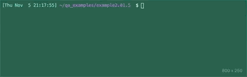

# Basic Unit Tests

#### Target Time Limit: +/- 30 minutes

## Summary

You're learning about unit testing! It's time to put your knowledge to the test,
and pick up a bit more, by testing a simple calculator.

<details  markdown="1"> <summary> <strong> For Your Review </strong> </summary>

If you're feeling uncertain on where to start in this project, look over the
following:

- Skills Practice:
  - <a target="\_blank" href="https://devmountain.github.io/qa_student_assignments/units/unit_2_fundamentals/2.01/sp2.01.1.html">Finish
    Tests with Values</a>
  - <a target="\_blank" href="https://devmountain.github.io/qa_student_assignments/units/unit_2_fundamentals/2.01/sp2.01.2.html">Finish
    Tests with Assertions</a>

</details>

</br>

## Setup

1. Using **Skills Practice 2.01.1**:
   <a target="\_blank" href="https://devmountain.github.io/qa_student_assignments/units/unit_2_fundamentals/2.01/sp2.01.1.html">Finish
   Tests with Values</a>
   - Use the unit testing setup created in that skills practice or
   - Follow the manual setup instructions there to set up a new folder for unit
     testing.
1. Create a new file in the folder named `basicUnitTests.test.ts`
1. Copy the following code into the file.
   <details markdown="1"><summary><code>basicUnitTests.test.ts</code></summary>

   ```typescript
   describe("Testing the calculator", () => {
     test("Example test", () => {
       expect(calculator.add(2, 50)).toBe(52);
     });
     test("Addition works", () => {
       expect(true).toBeTruthy();
     });
     test("Subtraction works", () => {
       expect(true).toBeTruthy();
     });
     test("Multiplication works", () => {
       expect(true).toBeTruthy();
     });
     test("Division works", () => {
       expect(true).toBeTruthy();
     });
     describe("Stretch Goals", () => {
       test("(2+2)/4 == 1", () => {
         expect(calculator.divide(calculator.add(2, 2), 4)).toBe(1);
       });
       test("(28/4)*(6/2)*(30-27+(3-4)) == 42", () => {
         expect(true).toBeTruthy();
       });
     });
   });

   const calculator = {
     /** Takes two numbers and adds them together.
      * @example
      * calculator.add(2, 3) == 5
      */
     add: (a: number, b: number): number => a + b,
     /** Takes two numbers and subtracts the second from the first.
      * @example
      * calculator.subtract(2, 3) == -1
      */
     subtract: (a: number, b: number): number => a - b,
     /** Takes two numbers and multiplies them together.
      * @example
      * calculator.multiply(2, 3) == 6
      */
     multiply: (a: number, b: number): number => a * b,
     /** Takes two numbers and divides the first by the second.
      * @example
      * calculator.divide(2, 3) == 0.5
      */
     divide: (a: number, b: number): number => a / b,
   };
   ```

   </details>

   </br>

1. You can check that everything copied in correctly by executing the code with
   the command: `npx jest basicUnitTests`
   - If you see something like this, you're all set.
     

## Step 1

1. Review the example test.
   - It asserts that `calculator.add(2, 50)` is equal to 52.
   - That test _is_ passing.
1. Populate the other basic tests, with at least one assertion each, though
   multiple assertions would be much more effective.

   - Are negatives handled correctly?
   - What about decimal point numbers?

   **Tests To Complete**

   1. Addition works
      - `calculator.add(x, y)`
   1. Subtraction works
      - `calculator.subtract(x, y)`
   1. Multiplication works
      - `calculator.multiply(x, y)`
   1. Division works
      - `calculator.divide(x, y)`

## Step 2

Run your tests, as described in the setup step. Check that all tests are
passing. These functions _should_ work, so if you run into a problem, double
check your code before assuming that the calculator is broken.

- Please note, that the placeholder `expect(true).toBeTruthy()` does not qualify
  as your passing assertion.

## Submit

Submit the assignment in Canvas by copying and pasting the code from your
`basicUnitTests.test.ts` file.

## Stretch

With the basic tests in hand, take a look at the tests in the **Stretch Goals**
section.

- You'll see multiple equations. The first test is already complete.
- Complete the second test by nesting your calculator calls appropriately.

For more practice, add more equations! Check your answers with different
assertions!
