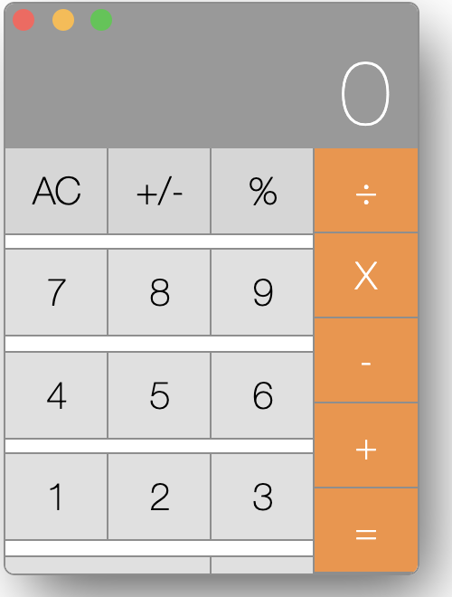

# Bug Fixes

#### Target Time Limit: +/- 90 minutes

## Summary

You'll be pulling down a broken calculator repository to apply some fixes, and
see if it works!

## Setup

You can find the repository here:
https://github.com/DevMountain/qa_calculator.git

1. Fork the repository to your own GitHub account.
   - You'll use your repo's URL in the next step.
1. Open your terminal/git bash and run the following commands:
   1. `git clone {your repo URL here}`
   1. `cd qa_calculator`
   1. `npm i`
   1. `npm start`

These commands will clone and install the calculator, and start the dev server.

- The calculator should load and look something like this:

## Fixing Bugs

The good news: we have a defined list of bugs to resolve. While this isn't
something you'll do every day in the industry, it will give you some
understanding of what your teammates are working on.

- If you'd like a bit of a challenge, try and find the three bugs we'll be
  fixing before we continue to the next step.
- Pop open the "Bug Fixes" below to fix them.

 <strong>Bug Fixes</strong> 

All bugs are in the same file: `qa_calculator/components/Calculator.js`

### Bug 1: Broken Formatting

It's not unusual to find one or more typos when a developer is in a hurry. In
this case, there is actually an extra "=" element.

There are two buttons in a row that are identical, with the same properties.

1. Remove one of the two.
1. Save, and see the cleaner UI rendered.

### Bug 2: Wrong Multiplication Symbol

Sure, an `x` works, but the calculator will look a lot better with the
multiplication symbol itself. This sort of bug is fairly common; some companies
don't call it a bug either; keep in mind that if something hurts the user
experience, it should be treated as a bug. Still, we work within the system, and
so might need to put in an "enhancement request" or something similar to resolve
a problem like this.

There is a button with a value of `'X'`, and a callback to set the operator to
`MULTIPLY`.

1. Change the value to `"×"`
1. Save, and see the button fixed in the UI.

### Bug 3: The "+" Button Subtracts

Kind of like the duplicate "=" button, sometimes when creating multiple similar
elelements, our developers get distracted.

There are two buttons that set the operator to `SUBTRACT`. One of them has the
value `"-"`, and is correct. The other has the value `"+"` and needs to be
fixed.

1. Change the callback of that button to `setOperator(operator.ADD)` instead of
   `setOperator(operator.SUBTRACT)`.
1. Save, and attempt an addition problem; see that the addition works.

&nbsp;

With all three bugs fixed, you should have a working calculator!

## Stretch

To really push yourself, you can try the following challenges:

- Change the coloring of the calculator to a different theme.
- Rearrange the order of the buttons, but maintain the functionality.

## Submission

Once again, you'll be able to push your changes up soon. For now, copy and paste
the code from your updated `Calculator.js` file into Canvas.

## Solution

If you would like to see the solution, check out the `qa_calculator` repo's
`solution` branch! It has a fully functional calculator.
