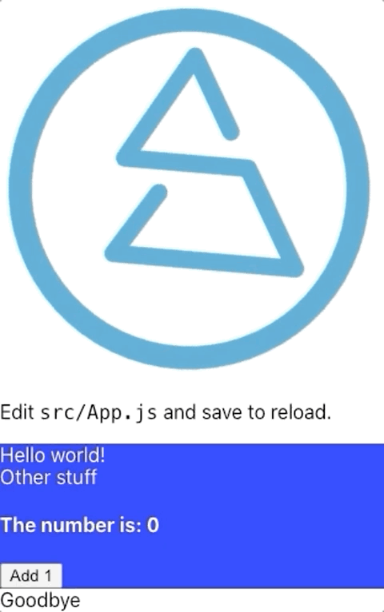
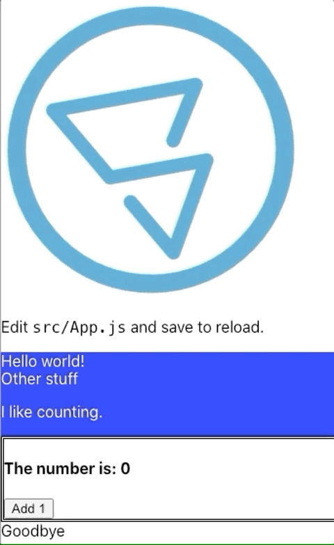
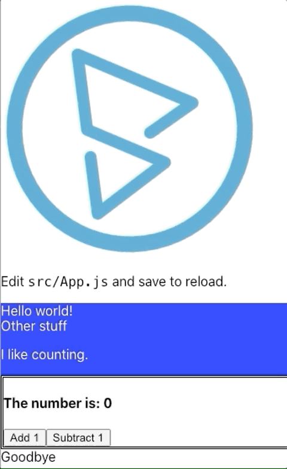

# Fun with web pages!

## Summary

This practice assignment will be to take the `qa_dom_intro` project and add to
it.

- A new block of text
- Styling the Counter component
- Adding a `Subtract 1` button to the Counter

---

## Setup

If you didn't follow along with the in class examples using this repo, you can
clone the repo, and checkout the 2.04 branch.

1. `git clone https://github.com/DevMountain/qa_dom_intro.git`
1. `cd qa_dom_intro`
1. `npm i`
1. `git checkout 2.04`

Whether you follow those steps, or already had the project working, make sure to
star the "dev server" `npm start`

You should see the app running: 

---

## **_Important:_**

- If you ever get lost/close the browser page, you should be able to access the
  running app at http://localhost:3000/.
- If the console running the app gets closed, running `npm start` from anywhere
  in the `qa_dom_intro` project will start it again.

---

## HTML - Add a block of text

In `src/App.js` you'll see the block of HTML returned from `App.js`.

1. Add a `<p>`, or paragraph, tag to the `<div>` that has "Other stuff" in it,
   and type in some text.
1. Save the file changes, and the page in your browser should auto-update with
   your changes.

- Example start:
  ```html
  <div>Some text</div>
  ```
- Example finish:
  ```html
  <div>
    Some text
    <p>Some other text.</p>
  </div>
  ```

---

## CSS - Add some style

We're going add a style to put the number counter in its own box.

1. Add an id to the `div` in the HTML the `Counter` component's `render` method.
   I'm calling mine `numberCounter`.
   ```html
   <div id="numberCounter"></div>
   ```
1. In the `index.css` file, copy in this new item at the bottom.
   ```css
   #numberCounter {
     /*
           We're adding a new style for anything with the id numberCounter
           1. A double line border
           1. An off-white background
           1. Black text
       */
     border-style: double;
     background-color: whitesmoke;
     color: black;
   }
   ```
1. Save everything. If it works correclty, the page will re-render:
   

---

## Data Binding -- Tweak the script!

Back in the `App.js` file, we're going to add in a new button to the counter to
`decrement` the number.

1. Copy and paste this new class Counter over the existing component.

   ```javascript
   class Counter extends Component {
     constructor() {
       super();
       // the number is stored in the component here
       this.state = { myNumber: 0 };
       this.incrementNumber = this.incrementNumber.bind(this);
       this.decrementNumber = this.decrementNumber.bind(this);
     }

     // this function updates the number in the state
     incrementNumber() {
       // we're logging a message in the console every time incrementNumber is called.
       console.log(`Adding 1 to ${this.state.myNumber}`);
       this.setState((state) => {
         return { myNumber: state.myNumber + 1 };
       });
     }

     // this new function will reduce `myNumber` by 1
     decrementNumber() {
       console.log(`Removing 1 from ${this.state.myNumber}`);
       this.setState((state) => {
         return { myNumber: state.myNumber - 1 };
       });
     }

     render() {
       // this displays the current number AND tells the button to use the incrementNumber function()
       return (
         <div id='numberCounter'>
           {" "}
           {/*We added the id here*/}
           <h4> The number is: {this.state.myNumber}</h4>
           <button onClick={this.incrementNumber}>Add 1</button>
           <button onClick={this.decrementNumber}>Subtract 1</button>
           {/* now it also instructs the component to render the "Subtract 1" button, which uses the function decrementNumber */}
         </div>
       );
     }
   }
   ```

1. When the page re-renders after saving, you'll see something like this:
   

---

## Solution

The solution for this assignment is in the `qa_dom_intro` repo's `2.04-solution`
branch; feel free to look that over if you get lost!

- https://github.com/DevMountain/qa_dom_intro/tree/2.04-solution

## Stretch

Go ahead and push yourself! Try making tweaks to the HTML, CSS or JavaScript!
