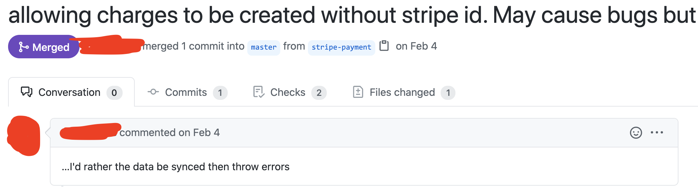
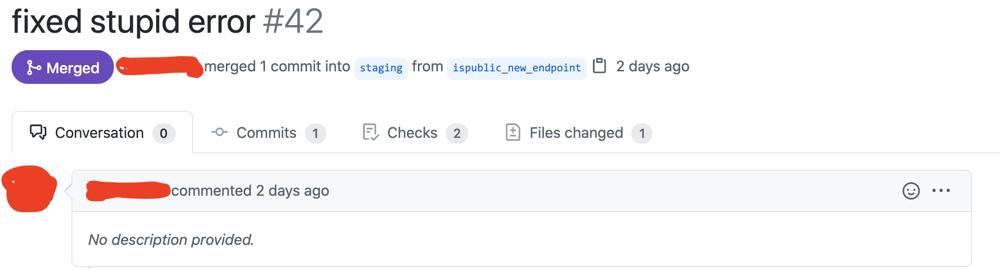
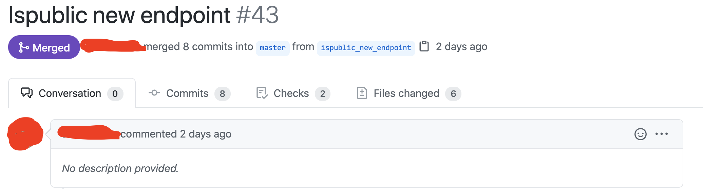

# Identify Risky Commits

## Summary

When we're testing products, we'll frequently be able to see the code being
commited to the projects.

This is good and bad.

- Bad, only really if it gets too distracting from accomplishing our goals.
- Good because we can check it out! Even if you don't know how to read the code,
  there are some identifiers you can look for.

## What's a Risky Commit?

A risky commit happens when a developer is adding a BUNCH of changes at once to
the product.

When I was a kid, I wanted the BIGGEST Super Soaker out there. If you don't know
what those were, water guns made by Nerf. My dad didn't let me get it.

> The more moving pieces there are, the faster it's going to break.

To this day, I don't know if the gun I wanted WOULD have broken, but hey, I'm
not bitter. The important thing is that what he said is, in general, true.

- The more complicated a system, the easier it is to break.
- The more changes made to a system at once, the more likely one of them is
  going to break something else.

The same rules apply to "pull requests", which are basically one or more commit
happening at the same time... There's more to it, but we'll talk about that
another time.

## What do you think?

We'll look at some examples, in house stuff at Devmountain... You should look at
a few markers.

1. Titles/Comments - what the developers say about their changes can tell us a
   lot!
1. How many files are changed - How many places are things changing?
   - Lines changes per file is something you can dig into, sure. But we'll stay
     simpler.
1. How many commits there are - How many tries/tweaks did it take to get things
   right?

There is no hard and fast ruleset to say, "This one, right here, it's the
defective PR (pull request) you're looking for!" There's a lot to be said for
going with your gut. Or, you know, talking to your teammate about their changes,
and what they think!

So, A, B, C; which is the riskiest, and why?

**A)**  &nbsp; **B)**
 &nbsp; **C)** 

How do you rank these? Why? Consider writing it up, or explaining it to someone;
whether or not they understand, getting the words out can help.

 
 My ranking... 

So, coming into this cold, just pulling some random pull requests/commits from a
repository, I could very well be wrong.

I think either **A** or **C** is riskiest.

**B**: LOW RISK This PR was a bug fix, and only had one file change, and one
commit, so it seems pretty low risk, relatively.

- Technically it looks like it's a fix to C, which may tell us something, but
  that's cheating at this point. We should look at them as if we were examining
  each alone for risk.

**C**: High Risk I'd call risky because it has the most file changes, and the
most commits. It was obviously a large effort, and therefore probably has "the
most moving pieces".

**A**: Possibly Highest Risk Without context it's hard to be positive, but
anything having to do with money already gets more scrutiny from me. Add to
that, the "May cause bugs but" comment, and I get worried. That said, only one
file changed, it may not be a big deal. If the change only has to do with
logging, or something, eh, no biggy. Could go either way.

&nbsp;

Now that you have an idea of which PR is hte riskiest, you know where you're
going to focus more of your time! If you learn you were wrong, adjust. That's
all there is to it.

When you get the chance, try to look over commits made to the projects you test!
Odds are good they won't mean much to you at first. But as you get more
practice, and as you work with your developers and they get used to your
questions, you'll find there is both more detail, and more you can learn.
