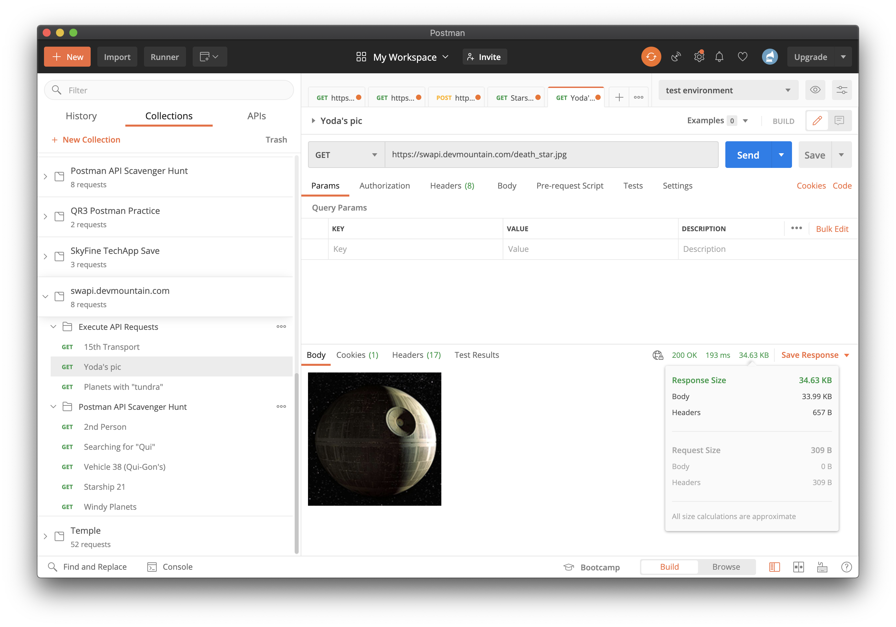

# Try JMeter Assertions

## Summary

JMeter has so many types of assertions. How do you know what's right for you?

Try these out and figure out what fits your style best!

- [Try JMeter Assertions](#try-jmeter-assertions)
  - [Summary](#summary)
  - [Assertion Results Listeners](#assertion-results-listeners)
  - [Response Assertion](#response-assertion)
    - [Response Code](#response-code)
    - [Response Message](#response-message)
    - [Text Response](#text-response)
  - [Size Assertion](#size-assertion)
  - [JSON Assertion](#json-assertion)
  - [Troubleshooting](#troubleshooting)

---

## Assertion Results Listeners

Whenever you are testing with assertions, make sure you have an "Assertion
Results" listener.

- Otherwise you'll never know if your assertion worked.

1. Right click the test plan.
1. Add > Listeners > Assertion Results
1. Check the box (in the listener) to "Log/Display Only: [ ] Errors"

This will work for all of the assertions in your test plan, regardless of thread
group. It will also make it easier to spot failures in large groups of requests.

## Response Assertion

This is a common, pretty simple to use assertion. It can evaluate:

- The text in a response's body.
- The response code.
- The response message.
- Response headers.
- Request headers.
- The URL requested/sampled.
- An attached document.
- The data in the request.

Many of these have less to do with the API responding correctly, and the API
being sent the proper response. That said, anything from the response can be
HUGELY beneficial to us.

### Response Code

In a JMeter library (you can use the one linked from our last exercise,
<a href="https://github.com/DevMountain/qa_playground/blob/2.10/src/solutions/2.10/SWAPI_Load.jmx" download>here</a>),
find a request that's getting information back.

1. Right click the sampler.
1. Choose Add > Assertion > Response Assertion
1. Set the "Field to Test" to "Response Code"
1. Change pattern matching to "Equals"
1. Make sure the "patterns to test" only includes "200".

This test will only pass if the response provided gives back a "200" response
code.

Add another that checks that the response code is "not" equal to "404".

1. Set the pattern matching to "Equals"
1. Check the "not" checkbox under pattern matching.
1. Add "404" to the "patterns to check".

### Response Message

- This works much the same, except that it looks for "OK" or "Server Error",
  etc. instead of 200, 500, etc.

### Text Response

This field is probably the most useful to check. The text response will
generally tell us whether or not we're getting back a valid response anyway.

We should have a JSON containing properties that contain the word "fair"?

- Like `https://swapi.devmountain.com/people/1`

1. Add that request if you don't have it already.
1. Add a Response Assertion.
1. Set the "Field to Test" to "Text Response".
1. Change the pattern matching to "Contains".
1. Make sure "Patterns to Test" only has "fair" in it.

This should pass.

- Since we are using "Contains" as the pattern match, we can add more patterns
  to match, as many as we want.

## Size Assertion

This is quite helpful for when we're getting an image or other file where we
aren't sure exactly how to query the specific content. At least we can be sure
if the content is there.

1. Find out how big the image/file/response _should_ be.
   - Postman is quite helpful for this.
   - 
1. Add a Size Assertion to the request in question.
1. Response Size Field To Test
   1. I generally use just "Response Body" - it seems the least flaky.
1. Set the expected size (in Bytes, so a 30.2KB file would be <= 30000 Bytes)
1. Choose the comparison operator: these work just like in programming and math
   everywhere.

## JSON Assertion

This assertion is great when you KNOW you're getting a JSON object back.

Our request: `https://swapi.devmountain.com/people/1` for example, gets back

```json
{
  "edited": "2014-12-20T21:17:56.891Z",
  "name": "Luke Skywalker",
  "created": "2014-12-09T13:50:51.644Z",
  "gender": "male",
  "skin_color": "fair",
  "hair_color": "blond",
  "height": "172",
  "eye_color": "blue",
  "mass": "77",
  "homeworld": 1,
  "birth_year": "19BBY",
  "image": "luke_skywalker.jpg",
  "id": 1,
  "vehicles": [14, 30],
  "starships": [12, 22],
  "films": [1, 2, 3, 6]
}
```

1. Here, add a JSON assertion.
1. "Assert JSON Path Exists:" `$.films` ($ represents the base of the JSON)
   - It does exist! `[1,2,3,6]`
1. So now, check the box "Additional assert value" and put that array in the
   "Expected Value" field.

## Troubleshooting

Here are a couple of ideas if these assertions aren't working for you.

1. Wipe the current results and start fresh:
   1. Look for the double broom icon in the top menu bar, and click it.
   1. Now run your tests again.
1. Double check you didn't check a "not" or an "or" box on accident.
1. Compare to another working test.
   1. See the SWAPI test linked earlier to see examples of all of these
      assertions in action!
