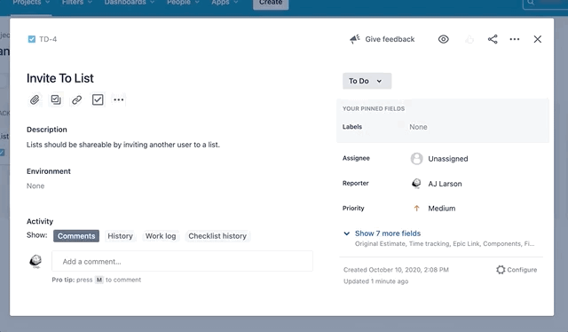
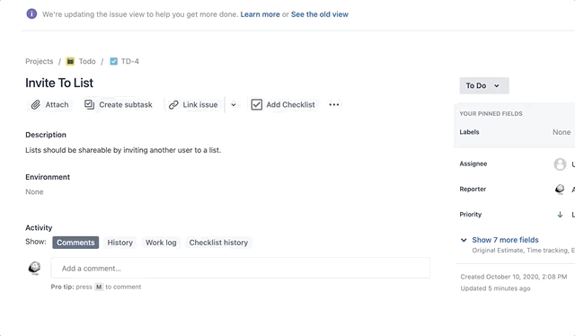

# Group Capstone - Plan Review

#### Target Time Limit: +/- 120 minutes

<table>
<tr>
<th> Table of Contents </th>
<th> Prior Content </th>
</tr>
<tr>
<td markdown="1">

- [Summary](#summary)
- [Grooming](#grooming)
  - [Breaking Down Tasks](#breaking-down-tasks)
  - [Prioritization](#prioritization)
- [Assign Tasks](#assign-tasks)
- [Up Next](#up-next)

</td>
<td markdown="1">

- <a href="../2.11/project2.01.html">Kickoff</a>
- <a href="../2.11/project2.02.html">Preliminary Planning</a>

</td>
</tr>
</table>

---

## Summary

Here, we make sure you're ready to go and get started on your automation work.

- Groom the work into workable, prioritized tasks
- Assign out work to begin

---

## Grooming

Grooming will have two main focuses:

- Are there tasks that are too broad/need more focus?
  - If so, break them down into multiple tasks/sub-tasks
- Do we know the order we need to get things done?
  - Reordering cards, or noting dependencies can make sure you don't get ahead
    of yourselves.

### Breaking Down Tasks

This is a quick project -- if you have any tasks that are going to take more
than a day or two of work, they might be too big.

You've got some options to deal with this:

1. Pair programming
   - Get together with a teammate and take turns; one of you is coding while the
     other observes. This lets you plan things out together, talk out issues,
     and gives the observer a chance to catch missed requirements/broken code,
     etc.
   - Honestly, this is a great practice ANYWAY.
1. More tasks/sub-tasks
   - You can take a larger task (i.e. Make Cart Page Object) and break it down
     further.
     - Create Cart Page Class w/important locators
     - Add method to edit amounts in cart
     - Add method to remove items from cart
     - Add method to proceed to checkout
     - Add method that returns an array of items/quantities in the cart
     - Add method to return cart subtotal

Generally it's better to tend to be too small vs too big; assuming that you're
tracking these tasks in Jira so that you don't have multiple teammates making
the same methods.

### Prioritization

Your tasks should be clearly prioritized so that you avoid two major issues:

- Working ahead on things that aren't ready
  - Like automating editing a saved favorites list when logging into an account
    isn't done
- Testing "nice to haves" instead of "need to haves"
  - Great automation on editing your profile image, when account creation and
    basic app functionality aren't automated yet.

Make sure you and the rest of the team are crystal clear on what work needs to
be done when. Once again, there are a few easy ways to do this.

1. Marking Priority
   - Issues in Jira can have priorities, lowest to highest. Marking the priority
     gives a quick visual indicator when someone is picking up their next task
     on what they should grab.
1. Linking Issues
   - There is a Requirements link; you can use it to show when one issue is
     required by another.
1. Ordering Cards
   - Jira will allow you to drag and drop to reorder cards on a board or in the
     backlog.
   - The cards at the top of you backlog/to do list are the ones that should be
     picked up first.

Using a combination of these methods, or your own, can keep your team on
track/together.

 Prioritization gif 

 Issue linking gif 

---

## Assign Tasks

When you are collaborating with your team, everyone needs to know who is doing
what. This avoids duplicating work/wasting time, and lets people know who to go
to with questions.

- I.E. Hey, I'm trying to use the Cart Page you made; how do I use this method?

This also lets you play to your team members' stregths, AND establish
accountability.

It's advisable not to go too far ahead in assigning tasks, just what you think
you'll be able to do in your first iteration on the project; that way if anyone
is done early OR stuck on something, there's more work to pick up.

---

## Up Next

Your next task will be to set things up for your GitHub repository to get
collaborating!
